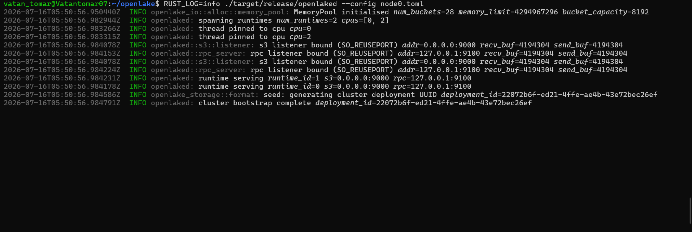

===================
Spark with OpenLake
===================

Overview
========

This guide shows how to use Apache Spark with OpenLake through its
S3-compatible API.

By the end of this guide, you will:

* build and start OpenLake,
* create an S3 bucket using a signed ``curl`` request,
* configure Spark to use OpenLake as its object store,
* write a Parquet dataset from Spark, and
* read the dataset back to verify the integration.

The steps in this guide were validated on Linux with Spark 3.5.5 running
in Docker.

Prerequisites
=============

Before starting, make sure you have:

* Git.
* Docker installed and running.
* Rust installed.
* ``curl`` with AWS SigV4 support.

This guide assumes that you have completed the environment setup
described in :doc:`../developer/environment_setup`.

Before You Begin
================

This guide uses a single-node OpenLake cluster for local development.
It is not intended as a production or multi-node deployment.

The example writes a small Parquet dataset to a bucket named
``test-bucket`` and reads it back through the Hadoop S3A connector.

Clone and Build OpenLake
========================

Clone the OpenLake repository and enter the project directory:

.. code-block:: bash

   git clone https://github.com/openlake-project/openlake.git
   cd openlake

Build the optimized OpenLake binaries:

.. code-block:: bash

   cargo build --release --workspace

The ``openlaked`` server binary is created at
``target/release/openlaked``.

Create the Local Configuration
==============================

Create the two data directories used by this single-node example:

.. code-block:: bash

   mkdir -p /tmp/openlake-data0 /tmp/openlake-data1

Create a configuration file named ``node0.toml`` in the repository
root:

.. code-block:: bash

   cat > node0.toml <<'EOF'
   self_id = 0

   data_dirs = [
     "/tmp/openlake-data0",
     "/tmp/openlake-data1"
   ]

   s3_addr = "0.0.0.0:9000"
   rpc_addr = "127.0.0.1:9100"

   set_drive_count = 2
   default_parity_count = 1

   region = "us-east-1"

   [[credentials]]
   access_key = "openlakeadmin"
   secret_key = "openlakesecret"

   [[nodes]]
   id = 0
   rpc_addr = "127.0.0.1:9100"
   disk_count = 2
   EOF

This configuration exposes the S3 API on port ``9000`` and defines the
credentials used later by both ``curl`` and Spark.

Start the OpenLake Server
=========================

Start OpenLake using the configuration file:

.. code-block:: bash

   RUST_LOG=info ./target/release/openlaked --config node0.toml

If the server starts successfully, it will bind the S3 endpoint and
initialize the local deployment. Leave this terminal running while you
complete the remaining steps in this guide.

The following screenshot shows the OpenLake server after it has started
successfully.

Create a Bucket
===============

Spark writes data into an S3 bucket. Before starting the Spark session,
create a bucket that will store the example dataset.

Before creating the bucket, verify that the OpenLake S3 endpoint is
reachable:

.. code-block:: bash

   curl --max-time 10 \
     --silent \
     --show-error \
     --output /tmp/openlake-endpoint-response.xml \
     --write-out "HTTP status: %{http_code}\n" \
     http://127.0.0.1:9000/

   cat /tmp/openlake-endpoint-response.xml

A running server returns ``HTTP status: 403`` with an ``AccessDenied``
response because the request is not signed.

Create the bucket using a signed S3 request:

.. code-block:: bash

   curl --max-time 20 \
     --silent \
     --show-error \
     --output /tmp/openlake-create-bucket-response.xml \
     --write-out "HTTP status: %{http_code}\n" \
     --aws-sigv4 "aws:amz:us-east-1:s3" \
     --user "openlakeadmin:openlakesecret" \
     --request PUT \
     http://127.0.0.1:9000/test-bucket

A successful request returns ``HTTP status: 200``.

Start a PySpark Session
=======================

This example runs PySpark inside the official Apache Spark Docker image.
The Hadoop S3A connector is loaded when the session starts so that Spark
can communicate with the OpenLake S3-compatible endpoint.

The Spark configuration must match the values in ``node0.toml``:

* ``spark.hadoop.fs.s3a.endpoint`` points to the OpenLake S3 endpoint.
  Because Spark runs inside Docker, this guide uses
  ``http://host.docker.internal:9000`` to reach port ``9000`` on the
  host machine.
* ``spark.hadoop.fs.s3a.access.key`` matches the configured
  ``access_key`` value, ``openlakeadmin``.
* ``spark.hadoop.fs.s3a.secret.key`` matches the configured
  ``secret_key`` value, ``openlakesecret``.
* Path-style access is enabled because OpenLake is reached through a
  custom S3-compatible endpoint.
* SSL is disabled because this local development server uses HTTP.

Run the following command:

.. code-block:: bash

   docker run -it --rm \
     --name spark-openlake \
     -v /tmp:/tmp \
     apache/spark:3.5.5 \
     /opt/spark/bin/pyspark \
     --conf spark.jars.ivy=/tmp/.ivy2 \
     --packages org.apache.hadoop:hadoop-aws:3.3.4 \
     --conf spark.hadoop.fs.s3a.endpoint=http://host.docker.internal:9000 \
     --conf spark.hadoop.fs.s3a.access.key=openlakeadmin \
     --conf spark.hadoop.fs.s3a.secret.key=openlakesecret \
     --conf spark.hadoop.fs.s3a.path.style.access=true \
     --conf spark.hadoop.fs.s3a.connection.ssl.enabled=false \
     --conf spark.hadoop.fs.s3a.aws.credentials.provider=org.apache.hadoop.fs.s3a.SimpleAWSCredentialsProvider

The first run may take a few minutes while Spark downloads the Hadoop
AWS dependencies.

When startup completes, Spark creates a ``SparkSession`` named
``spark``. The terminal then displays the Python prompt:

.. code-block:: text

   SparkSession available as 'spark'.
   >>>

Create and Inspect the DataFrame
================================

At the PySpark prompt, create a small DataFrame that contains three
rows.

.. code-block:: python

   df = spark.createDataFrame(
       [
           (1, "Alice"),
           (2, "Bob"),
           (3, "Charlie"),
       ],
       ["id", "name"],
   )

Display the DataFrame before writing it:

.. code-block:: python

   df.show()

The output should look like this:

.. code-block:: text

   +---+-------+
   | id|   name|
   +---+-------+
   |  1|  Alice|
   |  2|    Bob|
   |  3|Charlie|
   +---+-------+

Write the DataFrame to OpenLake
===============================

Write the DataFrame to the ``test-bucket`` bucket in Parquet format.

.. code-block:: python

   df.coalesce(1).write.mode("overwrite").parquet(
       "s3a://test-bucket/users"
   )

The command returns to the PySpark prompt after the write operation
completes successfully.

Read the Data Back
==================

To verify that the dataset was written successfully, read it back from
OpenLake using Spark.

.. code-block:: python

   read_df = spark.read.parquet("s3a://test-bucket/users")
   read_df.show()

The output should look similar to the following:

.. code-block:: text

   +---+-------+
   | id|   name|
   +---+-------+
   |  1|  Alice|
   |  2|    Bob|
   |  3|Charlie|
   +---+-------+

The following screenshot shows the dataset read successfully from
OpenLake.

.. image:: ../images/spark_openlake_read_output.png
   :alt: Reading a Parquet dataset from OpenLake using Spark
   :align: center

Troubleshooting
===============

If you encounter issues while following this guide, check the following:

* Verify that the OpenLake server is still running before starting
  PySpark.

* If bucket creation fails, verify that the OpenLake S3 endpoint is
  reachable with the unsigned ``curl`` request, then rerun the signed
  bucket-creation request.

* If the first ``docker run`` command takes a long time, Spark may be
  downloading the required Hadoop AWS dependencies. This only happens
  during the initial startup.

* Ensure that the endpoint configured for ``spark.hadoop.fs.s3a.endpoint``
  matches the OpenLake S3 endpoint.

Next Steps
==========

You have successfully configured Apache Spark to use OpenLake as an
S3-compatible storage backend.

You can now experiment with larger datasets, different Spark data
sources, or integrate OpenLake into your own Spark applications.
