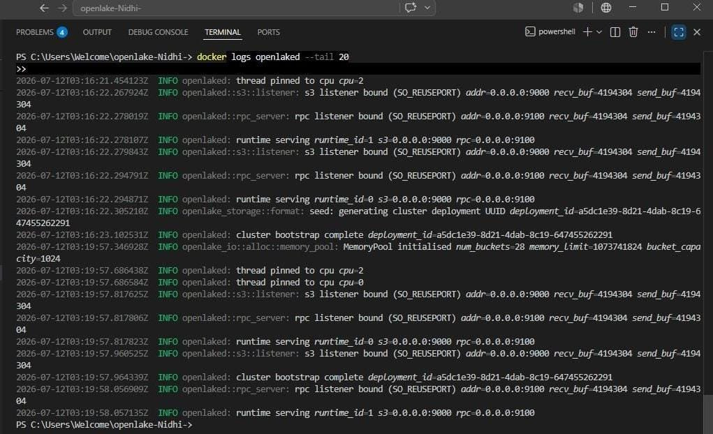
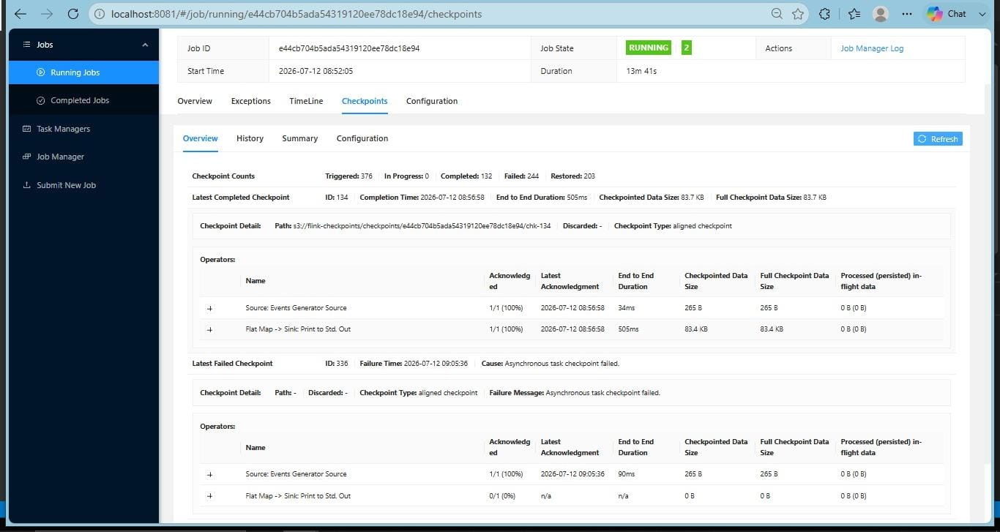

Apache Flink Checkpointing with OpenLake
==========================================
.. contents:: On this page
   :depth: 2

This guide sets up Apache Flink with OpenLake as the S3-compatible
checkpoint storage backend. It covers running an OpenLake cluster in
Docker and confirming that Flink checkpoints are actually written to and
read back from OpenLake, not just accepted without error.

Prerequisites
-------------

- Docker Desktop installed and running
- This repository cloned locally
- ``git`` and a terminal (PowerShell or bash)

Overview
--------

Here's what we're doing, roughly in order:

1. Build the OpenLake server image (``openlaked``)
2. Set up a single-node OpenLake cluster config
3. Start the OpenLake container
4. Start a Flink JobManager and TaskManager on the same network
5. Point Flink's checkpoint storage at OpenLake and create the bucket
6. Run a job and confirm checkpoints actually complete

Step 1: Create a Docker network
---------------------------------

Flink and OpenLake need to talk to each other, so put them on a shared
network first.

.. code-block:: bash

   docker network create flink-openlake-net

.. code-block:: text

   flink-openlake-net

Step 2: Write the OpenLake config
------------------------------------

Create ``config.toml`` at the repo root. This sets up a single-node,
4-disk cluster with 4+1 erasure coding. The ``data_dirs`` paths need to
exist inside the container — that's handled in the Dockerfile, so don't
worry about creating them yourself.

.. code-block:: toml

   self_id = 1
   data_dirs = ["/var/lib/openlake/data1", "/var/lib/openlake/data2", "/var/lib/openlake/data3", "/var/lib/openlake/data4"]
   s3_addr = "0.0.0.0:9000"
   rpc_addr = "0.0.0.0:9100"
   set_drive_count = 4
   default_parity_count = 1
   region = "us-east-1"
   transport = "h2"

   [[credentials]]
   access_key = "openlakeadmin"
   secret_key = "openlakeadmin"

   [[nodes]]
   id = 1
   rpc_addr = "127.0.0.1:9100"
   disk_count = 4

   [memory_pool]
   enabled = true
   size_bytes = 1073741824
   bucket_capacity = 1024

Step 3: Build the OpenLake image
------------------------------------

.. code-block:: bash

   docker build -t openlaked:latest -f docker/openlaked.Dockerfile .

This takes a while (20+ minutes on a fresh build). You're looking for:

.. code-block:: text

   [+] Building 1347.5s (22/22) FINISHED
   ...
   => naming to docker.io/library/openlaked:latest

Step 4: Run OpenLake
------------------------

.. code-block:: bash

   docker run -d --privileged --name openlaked \
     --network flink-openlake-net \
     -p 9000:9000 -p 9100:9100 \
     openlaked:latest

.. note::
   ``--privileged`` isn't optional here — without it the server panics on
   startup with ``PermissionDenied: Operation not permitted`` while
   setting up its async runtime.

Check it actually started:

.. code-block:: bash

   docker logs openlaked --tail 20

You should see something like this — the exact IDs will differ:

.. code-block:: text

   INFO openlake_io::alloc::memory_pool: MemoryPool initialised num_buckets=28 memory_limit=1073741824 bucket_capacity=1024
   INFO openlaked: spawning runtimes num_runtimes=2 cpus=[0, 2]
   INFO openlake::s3::listener: s3 listener bound (SO_REUSEPORT) addr=0.0.0.0:9000 recv_buf=4194304 send_buf=4194304
   INFO openlake::rpc_server: rpc listener bound (SO_REUSEPORT) addr=0.0.0.0:9100 recv_buf=4194304 send_buf=4194304
   INFO openlake_storage::format: seed: generating cluster deployment UUID deployment_id=3ce94150-ead9-4c95-869a-f2b769c6b24d
   INFO openlaked: cluster bootstrap complete deployment_id=3ce94150-ead9-4c95-869a-f2b769c6b24d

Step 5: Run Flink
---------------------

.. code-block:: bash

   docker run -d --name flink-jobmanager \
     --network flink-openlake-net -p 8081:8081 \
     -e FLINK_PROPERTIES="jobmanager.rpc.address: flink-jobmanager" \
     flink:1.18.1-scala_2.12 jobmanager

   docker run -d --name flink-taskmanager \
     --network flink-openlake-net \
     -e FLINK_PROPERTIES="jobmanager.rpc.address: flink-jobmanager" \
     flink:1.18.1-scala_2.12 taskmanager

.. note::
   Pin the exact tag ``1.18.1-scala_2.12``. The floating ``1.18`` tag
   pulled a build that threw
   ``java.lang.NoClassDefFoundError: scala.collection.convert.Wrappers$MutableSetWrapper``
   on startup for us — annoying to debug, easy to avoid.

Confirm both containers came up:

.. code-block:: bash

   docker ps -a

.. code-block:: text

   NAMES                STATUS
   flink-taskmanager    Up ...
   flink-jobmanager     Up ...
   openlaked            Up ...

Step 6: Point Flink at OpenLake
-----------------------------------

Add the following to ``/opt/flink/conf/flink-conf.yaml`` in **both**
containers, then restart them so the config actually takes effect:

.. code-block:: bash

   docker exec flink-jobmanager bash -c "cat >> /opt/flink/conf/flink-conf.yaml << 'EOF'
   state.backend: rocksdb
   state.checkpoints.dir: s3://flink-checkpoints/checkpoints/
   s3.access-key: openlakeadmin
   s3.secret-key: openlakeadmin
   s3.endpoint: http://openlaked:9000
   s3.path.style.access: true
   EOF"

   docker exec flink-taskmanager bash -c "cat >> /opt/flink/conf/flink-conf.yaml << 'EOF'
   state.backend: rocksdb
   state.checkpoints.dir: s3://flink-checkpoints/checkpoints/
   s3.access-key: openlakeadmin
   s3.secret-key: openlakeadmin
   s3.endpoint: http://openlaked:9000
   s3.path.style.access: true
   EOF"

Flink also needs the S3 Presto filesystem plugin enabled:

.. code-block:: bash

   docker exec flink-jobmanager mkdir -p /opt/flink/plugins/s3-fs-presto
   docker exec flink-jobmanager cp /opt/flink/opt/flink-s3-fs-presto-1.18.1.jar /opt/flink/plugins/s3-fs-presto/

   docker exec flink-taskmanager mkdir -p /opt/flink/plugins/s3-fs-presto
   docker exec flink-taskmanager cp /opt/flink/opt/flink-s3-fs-presto-1.18.1.jar /opt/flink/plugins/s3-fs-presto/

   docker restart flink-jobmanager flink-taskmanager

Before submitting anything, create the checkpoint bucket — Flink won't
create it for you:

.. code-block:: bash

   docker run --rm --network flink-openlake-net \
     -e AWS_ACCESS_KEY_ID=openlakeadmin \
     -e AWS_SECRET_ACCESS_KEY=openlakeadmin \
     amazon/aws-cli --endpoint-url http://openlaked:9000 \
     s3 mb s3://flink-checkpoints

.. code-block:: text

   make_bucket: flink-checkpoints

Step 7: Run a job and check the checkpoints
-----------------------------------------------

.. code-block:: bash

   docker exec flink-jobmanager flink run -d \
     /opt/flink/examples/streaming/StateMachineExample.jar

.. code-block:: text

   Job has been submitted with JobID <job-id>

Give it a minute to trigger a few checkpoints, then query the status:

.. code-block:: bash

   docker exec flink-jobmanager curl -s \
     http://localhost:8081/jobs/<job-id>/checkpoints

A healthy run looks like this:

.. code-block:: json

   {
     "counts": {"completed": 34, "failed": 1, "in_progress": 0},
     "latest": {
       "completed": {
         "id": 34,
         "status": "COMPLETED",
         "external_path": "s3://flink-checkpoints/checkpoints/<job-id>/chk-34"
       }
     }
   }

Same info is visible from the Flink UI at ``http://localhost:8081``,
under **Job → Checkpoints**. The **Latest Restore** row is the useful
one — it shows Flink actually reading a checkpoint back from OpenLake,
not just writing to it. The **Checkpointed Data Size** and **Full
Checkpoint Data Size** columns give you a rough sense of read/write
throughput per checkpoint.

Double-check the objects are really there
----------------------------------------------

The checkpoint counts above come from Flink's own bookkeeping, so it's
worth confirming the objects actually exist on OpenLake too:

.. code-block:: bash

   docker run --rm --network flink-openlake-net \
     -e AWS_ACCESS_KEY_ID=openlakeadmin \
     -e AWS_SECRET_ACCESS_KEY=openlakeadmin \
     amazon/aws-cli --endpoint-url http://openlaked:9000 \
     s3 ls s3://flink-checkpoints/checkpoints/<job-id>/ --recursive

.. code-block:: text

   2026-07-12 08:52:26      37888 checkpoints/<job-id>/chk-3/_metadata
   2026-07-12 08:52:26        265 checkpoints/<job-id>/chk-3/...

If you see the odd failed checkpoint, it's worth checking the OpenLake
logs (``docker logs openlaked``) around that timestamp before assuming
it's a Flink problem — and if it's not obviously explained, worth filing
as a separate issue rather than digging into it here.

Troubleshooting
----------------

``PermissionDenied: Operation not permitted`` on OpenLake startup
   Run the container with ``--privileged``.

``NoClassDefFoundError: scala.collection.convert.Wrappers$MutableSetWrapper``
   You're probably on the floating ``1.18-scala_2.12`` tag — switch to
   ``1.18.1-scala_2.12``.